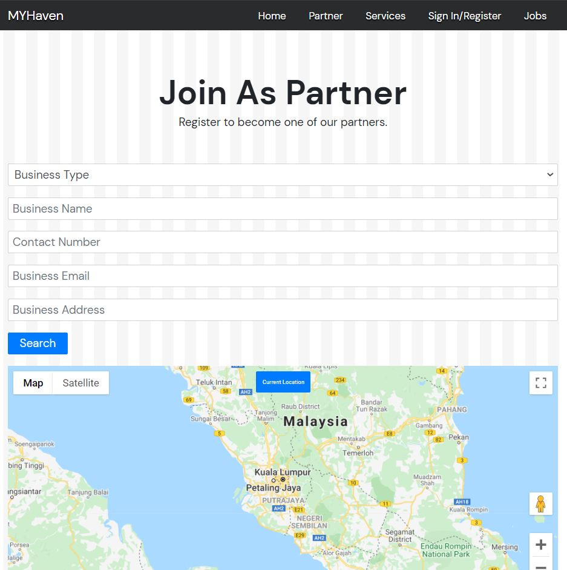

# YME Hackaton 2021 Submission - MYHaven

__VISIT [HERE](https://my-haven.herokuapp.com/)__

---

## Inspiration
Undeniably, covid 19 had hit hard on many industries. Malls and many businesses in Malaysia were forced to shut down as the country is in lockdown to tackle a worsening surge of the coronavirus that has put its health care system on the verge of collapse.

With intensive care wards hitting maximum capacity, the Health Ministry has warned doctors may eventually have to make the hard decision of allotting beds to COVID-19 patients with a better potential to recover. The military has set up field hospitals in some areas and several government hospitals are using shipping containers to store bodies as fatality climbs.

As for now, the covid cases in Malaysia are still high. Hospitals are fully booked and certain quarantine centers are packed with people. Only essential services are allowed to operate. If this situation persists, the economic situation will continue to worsen. 

In MY Haven, we provide a place for you to check for your nearby quarantine hotels and arrange your isolation period. From your daily essentials like food and drinks, to medical support like checkups and health screening, we’ve got you covered. What’s more, to assist the country in recovering economically, we also provide a platform for users to run errands or to apply for a job in the quarantine hotels.  
## What it does
We’ve come up with a system that connects the 3 main sectors, tourism, food and beverage and healthcare in a website. Through this platform, hotel managements and also small business owners (SME) can come together and assist each other hand in hand.

Our website can help users to search for a one-stop quarantine centre to stay, and during their stay, they are able to order food from nearby restaurants.
This website also aims to provide temporary job offers for those who have lost their income during the pandemic. They can apply for jobs through this website by running errands like sending food to the quarantine patients or assisting in medication deliveries. 

## How we built it
To develop this website, we mainly used HTML, JavaScript and CSS (SCSS) as our coding language. The main libraries used are Express.js for backend framework as well as Google Map API for mapping service. Once the applicants submit their registration form, the hotel location will be pinned on the Google map so that clients can find them.

## Challenges we ran into
Our main challenge is to get the precise location address of every hotel. We have a lot of features and ideas to add on. Unfortunately, due to time constraints, we did our best to code everything. We also can’t manage to build our own database (so we store the data in memory) due to time constraints.

## Accomplishments that we're proud of
For this system, we designed a webpage that allows users to register themselves and use the services provided. Our services include a quarantine hotel checking system, auto-locate nearby medical centers and food delivery service to the hotel. All these functionality can surely make your quarantine worry-free. 

## What we learned
We broadened our thinking about ways to help serve the community or nation: We want to help boost the nation's economic growth, and we believe that our idea is one simple way to start doing that. Having the opportunity to consider the various parties that such a website would benefit helped us better grasp the viewpoints of various users from different industries. This understanding is something we need when we want to help someone effectively.

## What's next for Team 5 - MY Haven
We aim to help the hotel business line in connecting with the healthcare sector and F&B. During phase 3&4 of NRP, we will help hotels to collaborate with nearby attractions such as amusement parks. Next, we also help to approximate the time when a state or the whole country transforms into a new phase and give users some suggestions to choose their places for vacation and book ahead of the hotel. For example, users are able to make a direct booking on themepack and hotels with promotional packages. We may provide an AI tour guide that directs users around the attractions nearby including F&B recommendations. They might have a chance to get a discount on the restaurant if the restaurant collaborates with their hotels.

